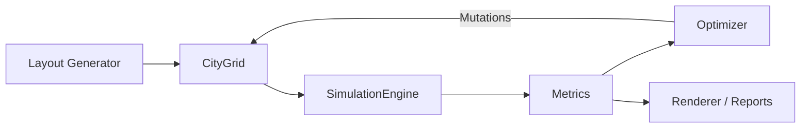
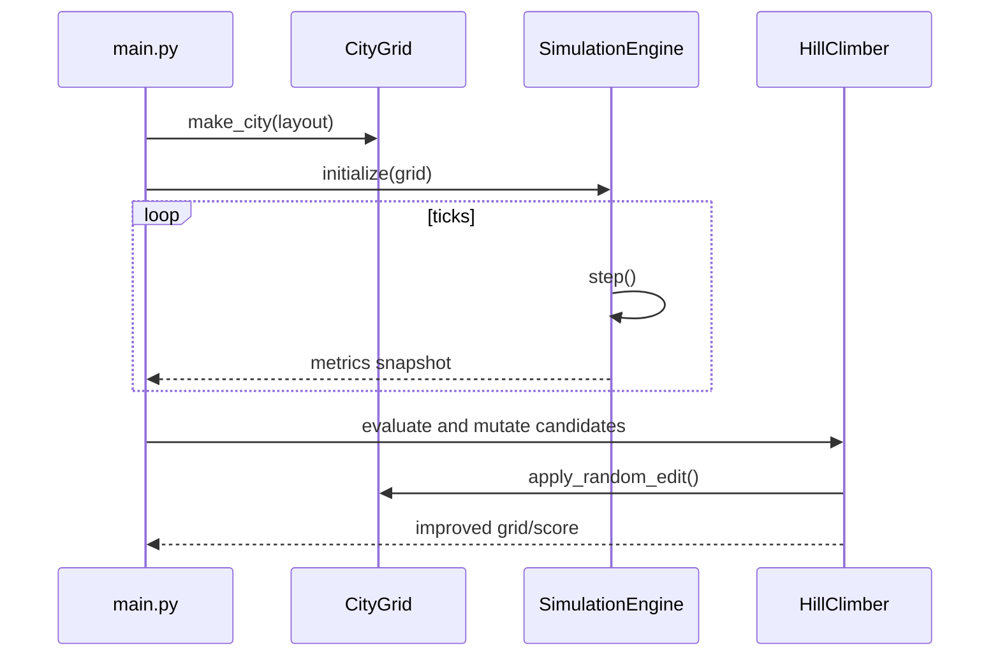

# AI City Planner

AI City Planner is a traffic-simulation and layout-optimization project with two execution surfaces:

- A Python optimization stack for repeatable experiments.
- A browser simulator for interactive city generation, editing, and visualization.

The project objective is simple: generate road networks, simulate traffic, score performance, and iteratively improve layouts.

## Why This Project Exists

Most city demos stop at map generation. This project focuses on the full loop:

1. Build a drivable road graph.
2. Route vehicles with A*.
3. Measure flow and congestion over many ticks.
4. Apply edits to the network.
5. Keep changes only when system-level metrics improve.

That gives a practical baseline for future RL or search-based planning policies.

## Latest Updates (Apr 2026)

### Browser release V6.5

- Added a bottom-left zoning toggle that draws colorful zone-boundary outlines.
- Added a zone legend panel that appears when zoning overlay is enabled.
- Improved district realism with more organic zone shape warping.
- Added more special buildings per zone (landmarks/civic, apartments/villas, plants) for clearer district identity.
- Updated browser release metadata and map export version to V6.5.

### Browser release V6.4

- Fixed the intersection lockup issue by removing over-restrictive junction entry gates.
- Kept movement safety while enabling smoother conflict resolution at intersection edges.
- Added demand-driven multi-spawn tick logic for more realistic active city traffic.
- Rebalanced density and finalized the active-car cap at 500 for stable runtime behavior.
- Updated browser release metadata and map export version to V6.4.

### Browser release V6.3

- Merged optimized rendering with offscreen caching for ground, buildings, roads, and minimap roads.
- Replaced linear-scan A* frontier selection with a binary-heap priority queue.
- Removed per-tick full car sorting in favor of a linear-time prioritized drive-order pass.
- Added precomputed signal-intersection cache to avoid full-map light updates each tick.
- Throttled HUD updates and refreshed release metadata/UI labels to V6.3.

### Browser release V6.2

- Stabilized highway spacing with stronger dominant-axis corridor separation.
- Reduced near-parallel shifted highway artifacts.
- Preserved sparse ramp spacing and highway-favoring travel costs.

## High-Level Architecture



## Repository Map

### Core Python modules

- `main.py`
  - CLI entrypoint.
  - Runs baseline, visual, optimization, and env test modes.
  - Contains hill-climbing optimization loop and score function.

- `grid.py`
  - `CityGrid` data model (numpy 2D grid).
  - Tile semantics: `EMPTY`, `ROAD`, `HIGHWAY`, `INTERSECTION`.
  - Includes generation and mutation helpers.

- `traffic_sim.py`
  - A* pathfinding with `heapq` priority queue.
  - `Car` entity model and per-tick update logic.
  - `SimulationEngine` for spawning, movement, collision checks, and metrics.

- `visualize.py`
  - Pygame renderer for simulation playback.
  - Draws tiles, cars, congestion overlays, and HUD metrics.

- `environment.py`
  - Gym-style wrapper for RL integration experiments.

### Browser simulator

- `city_visual.html`
  - Procedural city generation with hierarchical roads.
  - Real-time traffic simulation and controls.
  - In-app editor tools, minimap, metric panels, and map import/export.

## Python Runtime Flow



## Data Model Summary

### Grid state

- Representation: `numpy.ndarray` shaped `(height, width)`.
- Coordinates: `(x, y)` but stored as `grid[y, x]`.
- Drivable cells: road, highway, intersection.

### Vehicle state

- Current tile position.
- Destination tile.
- Remaining waypoint path.
- Travel-time accumulator.
- Stopped flag and intersection wait behavior.

### Metrics tracked

- `avg_travel_time`
- `stopped_cars`
- `congestion_map`
- `completed_cars`
- `active_cars`

## Optimization Strategy (Current)

The current optimizer is a hill-climbing search in `main.py`:

1. Evaluate baseline layout.
2. Clone current best layout.
3. Apply random edits to candidate layouts.
4. Simulate each candidate for fixed ticks.
5. Accept only strict score improvements.

Current objective score (lower is better):

$$
  ext{score} = 1.0\cdot\overline{travel} + 2.0\cdot\overline{stopped} + 40.0\cdot\overline{congestion}
$$

## CLI Usage

### 1) Install dependencies

```bash
pip install -r requirements.txt
```

### 2) Run optimization (default workflow)

```bash
python main.py --mode optimize
```

### 3) Useful optimization variants

```bash
python main.py --mode optimize --ticks 300 --iterations 25
python main.py --mode optimize --candidates-per-iter 12 --edits-per-candidate 5
python main.py --mode optimize --visualize-results
```

### 4) Other modes

```bash
python main.py --mode visual
python main.py --mode headless
python main.py --mode envtest
```

## Browser Simulator Notes

Open `city_visual.html` directly in your browser.

It includes:

- City generation + simulation controls.
- Zoom/pan/minimap.
- Interactive road/zoning editor.
- Stop-reason and congestion diagnostics.
- Import/export of map state.

Version history is tracked in `portfolio_change_log.txt`.

## Extension Points

If you want to evolve this codebase, these are the best insertion points:

- Replace hill climbing with learned policy search in `main.py`.
- Add richer network edits in `grid.py` (lane count, one-way rules, turn penalties).
- Introduce signal policies and dynamic timing in `traffic_sim.py`.
- Feed richer observations/rewards through `environment.py`.
- Add reproducible experiment logging (CSV/JSON) for benchmark comparisons.

## Known Constraints

- Current optimizer is stochastic and local (can get stuck in local minima).
- Grid abstractions are intentionally coarse and lane-level realism is simplified.
- Browser and Python simulations are related but not identical implementations.

## Project Status

The project is currently a strong prototype baseline:

- Deterministic enough for repeatable scoring loops.
- Fast enough for iterative optimization experiments.
- Structured enough to serve as a foundation for RL-based planners.
